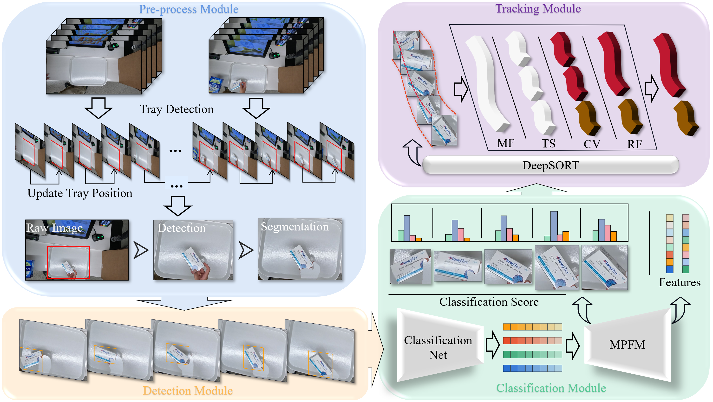

AdaptCD: An Adaptive Target Region-based Commodity Detection System
===

This project (based on [mmdetection](https://github.com/open-mmlab/mmdetection) && [mmclassification](https://github.com/open-mmlab/mmclassification) && [DeepSort](https://github.com/nwojke/deep_sort)) is the re-implementation of our paper.

## Introduction

 The system has been validated in Multi-Class Product Counting & Recognition for Automated Retail Checkout (2023 AI CITY Challenge Task4) competition, where our results achieve F1 Score of 0.9787 in Task4 testA, ranking second in 2023 AICITY Challenge Task4.
 In light of the above perspectives, a self-adaptive target region-based product detection system is proposed to address the challenges of automated retail checkout. The main contributions of this work are as follows:
1) An Adaptive Target Area Commodity Detection System is designed and verified in 2023 AI CITY Challenge Task4, and it achieves very high accuracy in commodity detection.
2) A novel data augmentation approach and targeted data synthesis methods are developed to create training data that is more representative of real-world scenarios.
3) A Dual-detector Fusion Algorithm is designed for the product detection problem, which is used to output the final detection boxes.
4) A cost-effective Adaptive Target Region Algorithm is introduced to mitigate the impact of camera movement on object detection and tracking in the test videos.
5) MPFM is designed to effectively fuse the feature representations from multiple classifiers and provide reliable product feature representations for tracking, leading to more stable and accurate classification and tracking results.




## Data-Preparing

### 1. Training
1. Download images and annotations for training detection from [GoogleDrive-det](https://drive.google.com/file/d/1zhIEYGuDviOr4N5ZV8nNbWcIDSB2a2oY/view?usp=sharing).
2. Download images and annotations for training detection with mask from [GoogleDrive-det-Cascade_mask_rcnn](https://drive.google.com/file/d/1S-8DYRyYwvNMR2k6bTodxR85ibxRsmw9/view?usp=share_link).
3. Download images for training classification from [GoogleDrive-cls](https://drive.google.com/file/d/1k1k6b-cQ9UEh5_L3pVi1DHuYeqovi2Va/view?usp=sharing).
4. Download images for fine tuning from [GoogleDrive-cls-fine-tune](https://drive.google.com/file/d/1PK4a64MWz_xDj4appGRuQcnHV_FSSpQj/view?usp=share_link) 
```
data
├── coco
│   └── annotations
│   └── train2017
│   └── val2017
├── cls
│   └── meta
│   └── train
│   └── val
```

### 2. Testing
Please place the videos you want to test in the [test_videos](./test_videos) folder.
```
test_videos/
├── testA_1.mp4
├── testA_2.mp4
├── testA_3.mp4
├── testA_4.mp4
├── video_id.txt
```

## Quick & Easy Start

### 1. Environments settings

* python 3.7.12
* pytorch 1.10.0
* torchvision 0.11.1
* cuda 10.2
* mmcv-full 1.4.3
* tensorflow-gpu 1.15.0

```shell
1. conda create -n AdaptCD python=3.7
2. conda activate AdaptCD
3. conda install pytorch==1.10.0 torchvision==0.11.0 torchaudio==0.10.0 cudatoolkit=11.3 -c pytorch
4. pip install mmcv-full==1.4.3 -f https://download.openmmlab.com/mmcv/dist/cu113/torch1.10.0/index.html
5. pip install -r requirements.txt
6. sh ./tools/setup.sh
```
Prepare train&test data by following [here](#data-preparing)

### 2. Train/Test:

* Step1: training.
```shell
# 1. Train Detector
# a. Single GPU
python ./mmdetection/tools/train.py ./mmdetection/configs/detectors/detectors_cascade_rcnn_r50_1x_coco.py
# b. Multi GPUs(e.g. 2 GPUs)
bash ./mmdetection/tools/dist_train.sh ./mmdetection/configs/detectors/detectors_cascade_rcnn_r50_1x_coco.py 2

# 2. Train Classifier
# a. Single GPU
bash ./mmclassification/tools/train_single.sh
# b. Multi GPUs(e.g. 2 GPUs)
bash ./mmclassification/tools/train_multi.sh 2
```

* Step2: testing.
Please place the all models in the [checkpoints](./new_checkpoints) folder. These models can be downloaded from [b2.pth](https://drive.google.com/file/d/1Sn476mEAOQ8vptrfYqEgLKeOPUXhj2sX/view?usp=share_link) [best_DTC_single_GPU.pth](https://drive.google.com/file/d/14uxbyXYcsBxAjY5JQhpv4a6uuwqyvMlG/view?usp=share_link) [cascade_mask_rcnn.pth](https://drive.google.com/file/d/1GIwM9V5IEWGOUiNOtCFk2r5v-bdYRSv3/view?usp=share_link) [detectors_cascade_rcnn.pth](https://drive.google.com/file/d/1HMEIdPt3GSGDy8uBe8ZuwY5prqG62oEc/view?usp=share_link) [detectors_htc.pth]()
[feature.pth](https://drive.google.com/file/d/1AF_dru1ufAEiOSG5aNXykzpnEQbOOgnQ/view?usp=share_link)
[s50.pth](https://drive.google.com/file/d/11KXnl0CS1ZPII4t5hpNNwk6VrWeovHo5/view?usp=share_link)
[s101.pth](https://drive.google.com/file/d/1rnQdQO4NvhJ5U7_-UFGqUytvuIg_UaSc/view?usp=share_link)

```
new_checkpoints/
├── b2.pth
├── best_DTC_single_GPU.pth
├── cascade_mask_rcnn.pth
├── detectors_cascade_rcnn.pth
├── detectors_htc.pth
├── feature.pth
├── s50.pth
├── s101.pth
```

Command line
```shell
# 1. Use the FFmpeg library to extract/count frames.
python tools1/extract_frames.py --out_folder ./frames
# 2. AdaptCD
python tools1/test_network.py --input_folder ./frames --out_file ./results.txt
```

# Contact

If you have any questions, feel free to contact Zeliang Ma (mzl@bupt.edu.cn).
